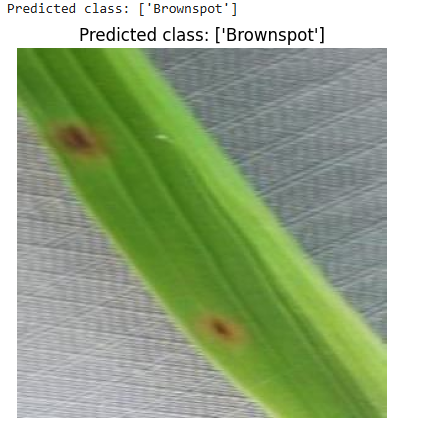

# Image-calssification🌾
This project applies deep learning to classify rice leaf diseases using images. We used EfficientNetB0 and ResNet50 for feature extraction and trained Logistic Regression and Custom Neural Networks for final classification.

## Models Used
- EfficientNetB0 + Logistic Regression
- ResNet50 + Logistic Regression
- Custom PyTorch Neural Network

## Dataset
[Kaggle: Rice Leaf Disease Images](https://www.kaggle.com/datasets/nirmalsankalana/rice-leaf-disease-image)

## Results
- Logistic Regression (EfficientNetB0): **93.5%**
- Neural Network (EfficientNetB0): **95.3%**

## Example Output

